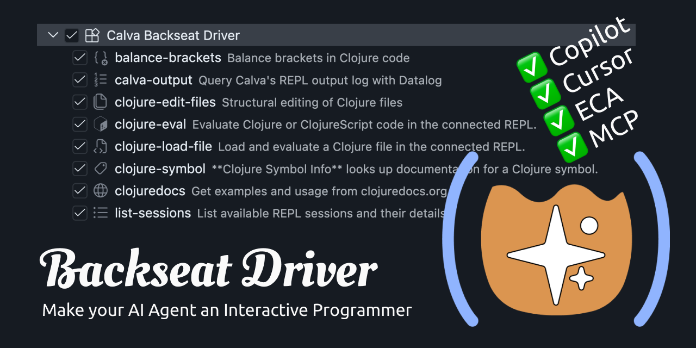

# Calva Backseat Driver

- **Evaluate Clojure Code**
  - The agents love Interactive Programming
  - Supports parallel agent work on the same REPL
- **List REPL sessions**
  - Sees and can target all connected REPLs
- **Full Output Log Acces**, with history
- **Load files**
- **Structural Editing Tools**, with batch support
  * **Create Clojure File(s)**
  * **Append Code**
  * **Replace Top Level Form** 
  * **Insert Top Level Form**
- **Bracket Balancer**
- **Symbol lookup**
- **Clojuredocs**

(Not to be confused with: *[github.com/PEZ/backseat-driver](https://github.com/PEZ/backseat-driver))*

## **Install Extension and done**

Extra MCP support via
`~/.config/vscode-mcp/registry`

