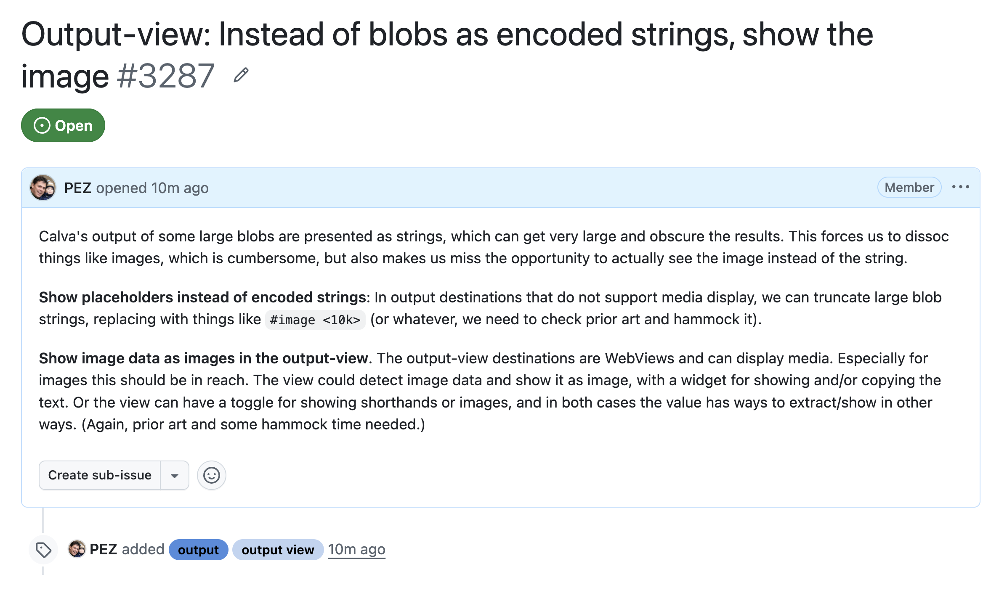

# Something to Crank

## Ideas

1. Make Crankin use non-Cursor TUI:s
1. Make a general **Crankin recipe**
1. Enable Crankin from VS Code (without Grok Bot)
1. **Fix Crankin**, moving it to someone elses computer
1. Teach Bots to **standup Calva for development**
1. Add image display to **Calva Output-views**?
1. **Eject Crankin** from GrokBot
1. Drive **[Jev](https://console.typesafe.ai/hook)** from **Epupp**, e.g. to tag GitHub issues
1. ...

*[calva#3287](https://github.com/BetterThanTomorrow/calva/issues/3287)*

