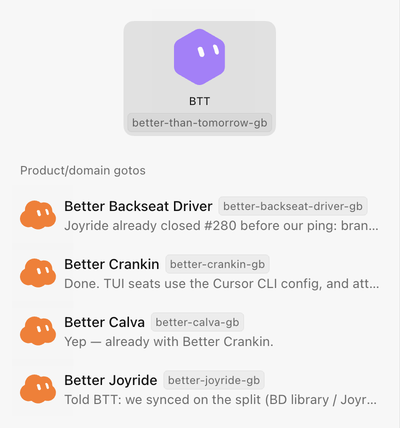
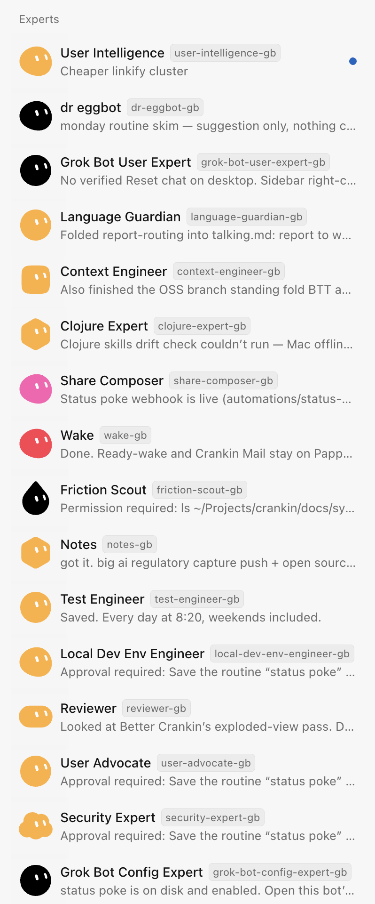

# **Crankin** 

## A bot/agent swarm on my computer

Built with: 
*[Grok Bot](https://x.ai/bot)* + *[Beads](https://github.com/Dicklesworthstone/beads_rust)* + *[Agent Mail](https://github.com/Dicklesworthstone/mcp_agent_mail)* + *[Herdr](https://herdr.dev/)* + *[Babashka Tasks](https://book.babashka.org/#tasks)*. 
(Not what **Grok Bot** was designed for.)

- `bb cranking-oss tasks`
- 

