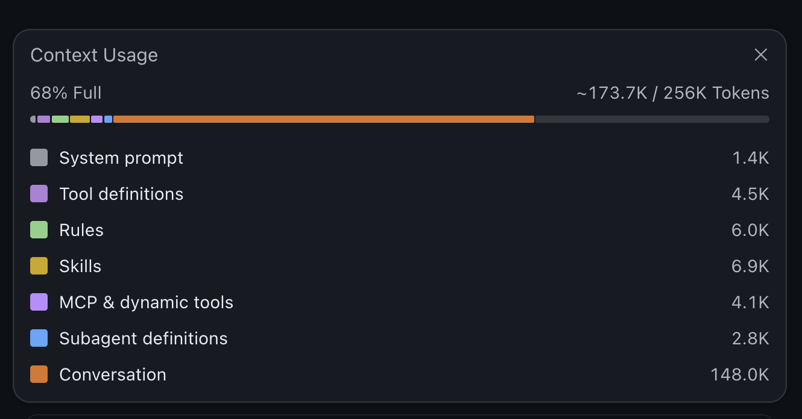
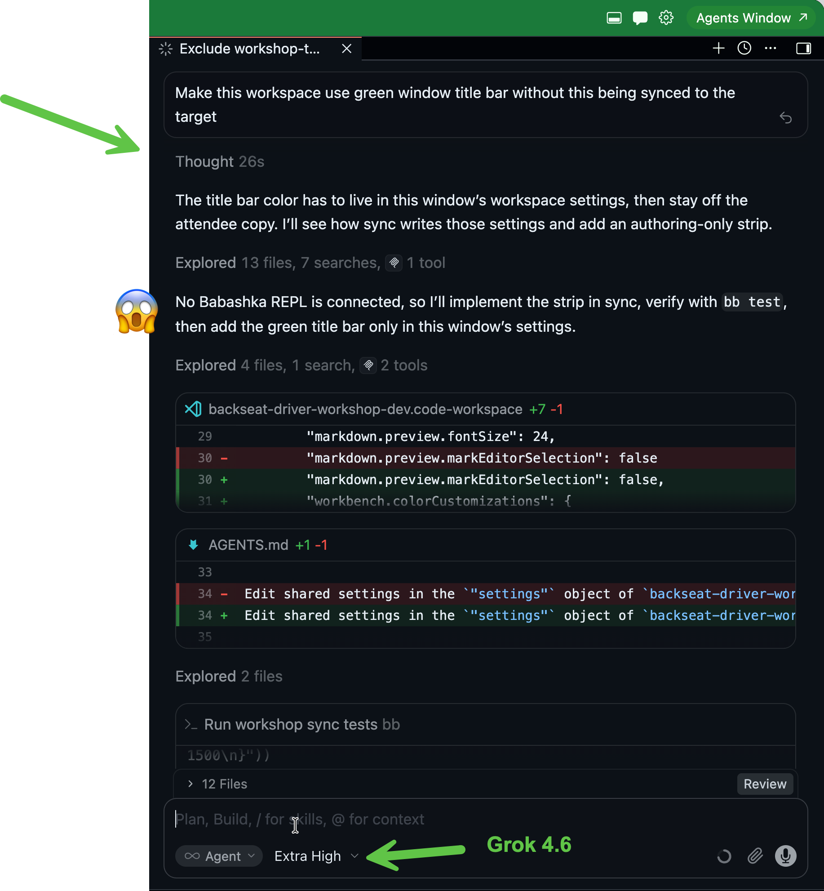

# Terminology

- **Model**: The actual AI
- **Chat session/Conversation**: Prompts and responses sent to the **model**
- **Harness**: Program/extension hosting chat sessions
- **Instructions**: Markdown files loaded by the **harness**
  - **Skill**: Teaches agents to do something, a folder in `skills`
- **Agent**: A goal-oriented, **harnessed model**, with **instructions**
- **Tools**: Structured input, producing structured output
- **Context Window**: All **instructions**, **tool** descriptions, 
- **MCP**: Protocol for providing **agents** with **tools** and **instructions**

