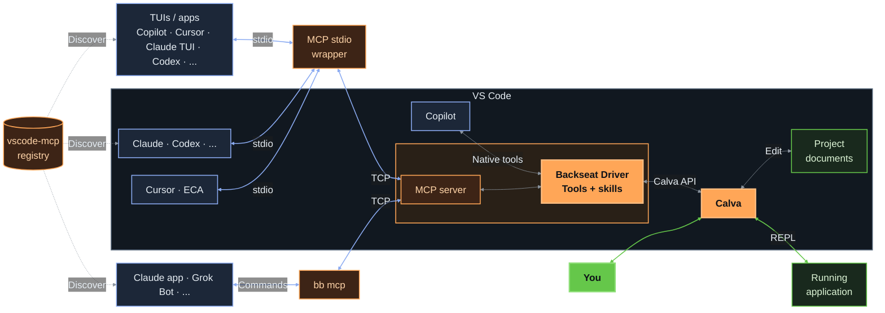

# Backseat Driver is Project Editor **Situated**

Connected to your work/project via Calva

* Situated support from **vscode-mcp**
* Two external paths to the MCP server:
  1. **stdio** wrapper/relay
  2. **bb mcp** a babashka task in the **vscode-mcp registry**

