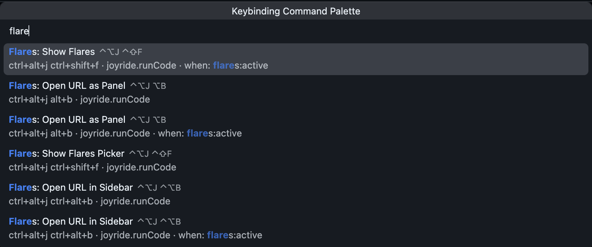

# Joyride utils in the project

- [next_slide.cljs](.joyride/src/prezo/next_slide.cljs) The slide presenter used by this project
- [pastedown.cljs](../.joyride/src/pastedown.cljs) paste rich text as Markdown
- [keybinding_palette.cljs](../.joyride/src/keybinding_palette.cljs) the missing Keybindings Palette in VS Code
- [flares.cljs](../.joyride/src/flares.cljs) open URLs and manages opened flares

You find them in [.joyride/src](../.joyride/src).

If you want them globally on your machine (you do), ask the agent to do it for you. (It will know what to do.)

