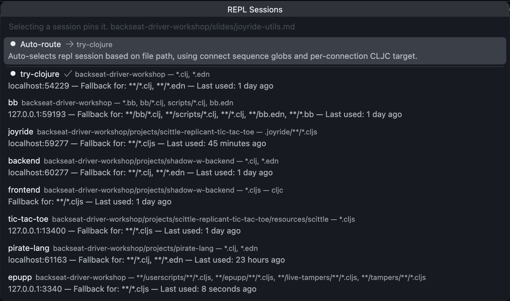

# Let's add sessions

1. ✅ **try-clojure** (Clojure)
1. ✅ **bb**
1. **joyride** (the agent doesn't need this)
1. **tic-tac-toe** (Scittle)
1. shadow-cljs
   1. **backend** (Clojure)
   1. **frontend** (ClojureScript)
1. **pirate-lang** (Clojure)
1. *Bonus*: **epupp** (Scittle as a browser extension)

### **joyride**

1. **Calva: Start Joyride REPL and Connect**

### **tic-tac-toe** (Scittle)

1. **Calva: Connect to a Running REPL Server in the Project** <kbd>ctrl+alt+c ctrl+alt+c</kbd>
    1. Project root: `projects/scittle-replicant-tic-tac-toe/resources/scittle`
    1. Connect Sequence: **Scittle Tic-Tac-Toe**
1. Open [ttt_flare.cljs](../projects/scittle-replicant-tic-tac-toe/.joyride/src/ttt_flare.cljs)
    1. **Calva: Load/Evaluate Current File and its Requires/Dependencies** <kbd>ctrl+alt+c enter</kbd>
    1. RCF `(replicant-ttt 13400)` **Calva: Evaluate Top Level Form (defun)** <kbd>alt+enter</kbd>

Open [replicant_tictactoe/core.cljs](../projects/scittle-replicant-tic-tac-toe/resources/scittle/replicant_tictactoe/core.cljs) and inspect state and play some Tic-Tac-Toe. **Ask the agent to join**.

### shadow-cljs

1. Create the **Shadow fullstack** connect sequence from the previous slide.
1. Open [dev/repl.clj](../projects/shadow-w-backend/src/dev/repl.clj)
1. **Calva: Start a Project REPL and Connect (aka Jack-In)** <kbd>ctrl+alt+c ctrl+alt+j</kbd>
1. Accept suggested `projects/shadow-w-backend` project root
1. Select the **Shadow fullstack** connectsequence
1. **Calva: Load/Evaluate Current File and its Requires/Dependencies** <kbd>ctrl+alt+c enter</kbd>
1. Evaluate `(go!)` <kbd>alt+enter</kbd>
1. Open http://localhost:3003 (e.g. in VS Code/Cursor browser, and as two Joyride Flares)

The frontend entrypoint is in [frontend/app.cljs](../projects/shadow-w-backend/src/main/acme/frontend/app.cljs). There are some rich comments forms there you can play with.

> *Target the different runtimes*.

### **pirate-lang** (Clojure)

1. Open [pirate_lang.clj](../projects/pirate-lang/src/pez/pirate_lang.clj) and Jack in

