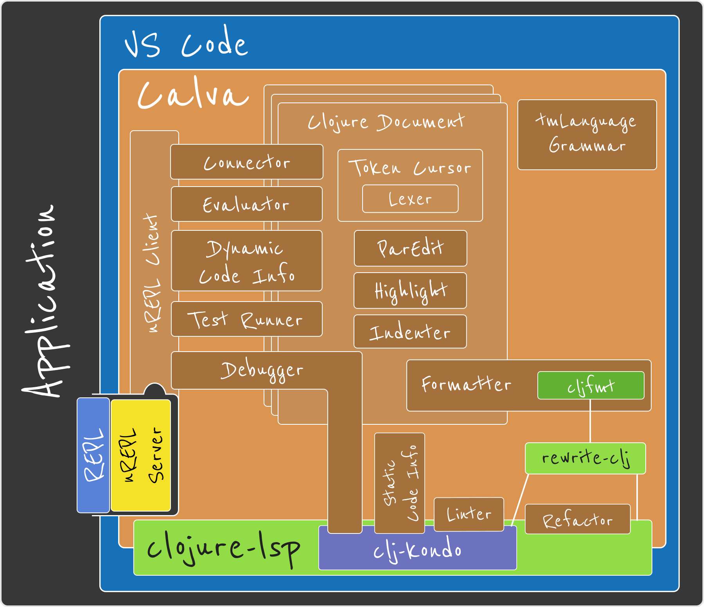

# Settings, where?

- VS Code: `settings.json`, `*.code-workspace`, `keybindings.json`, `tasks.json`
- Calva:
  - VS Code
  - `.calva/config.edn`, `~/.config/calva/config.edn`
  - `cljfmt.edn`
- nREPL: `nrepl.edn`
- REPL: `deps.edn`, `project.clj`, `bb.edn`, …
- clojure-lsp / clj-kondo / cljfmt configs

Today:
- Calva formatter
- Connect Sequences
- REPL Commands

