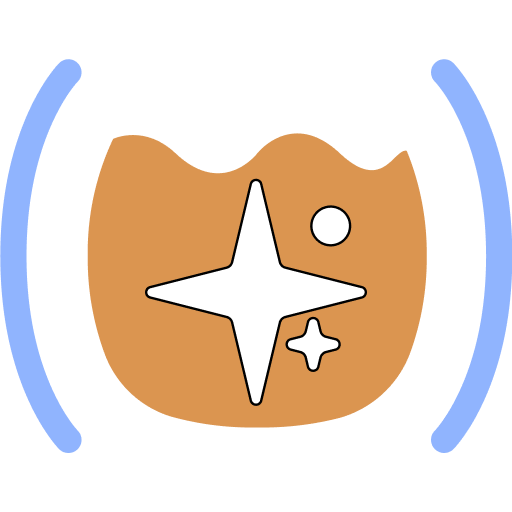

# Try Backseat Driver

## Setup Depends on Harness

- **Copilot**: None
- **Cursor**: None
- **ECA**: Managed config
- **MCP supported?**: Point agent at: `~/.config/vscode-mcp/registry`
- **MCP *not* supported?**: Point agent at: `~/.config/vscode-mcp/registry`

## The Workshop Project 

[github.com/PEZ/backseat-driver-workshop](https://github.com/PEZ/backseat-driver-workshop)

 QR](../images/qr-workshop-url.png)

