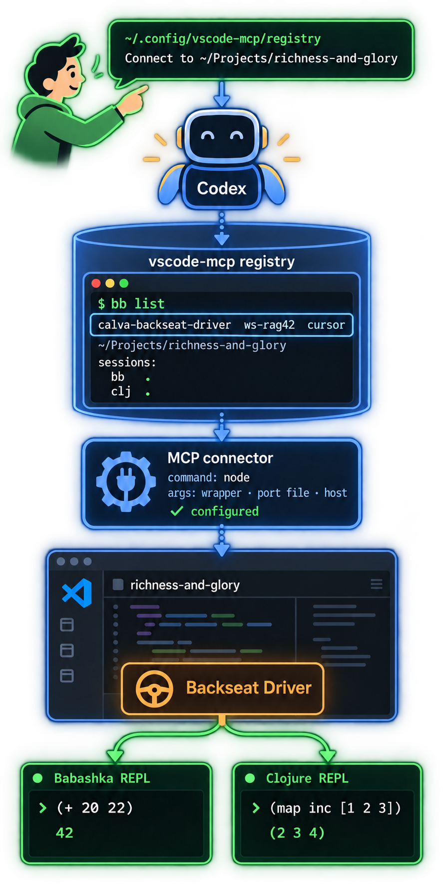

# The **vscode-mcp** Registry

For harnesses that are not Copilot, Cursor, or ECA

* `~/.config/vscode-mcp/registry`
* **bb list**
  * Discover info for MCP server config
  * VS Code instance + **vscode-mcp** client + window + REPL **session**
* **bb mcp**
  * Command line mcp client
  * One command invokation per tool use
  * The agents sometimes default to this

